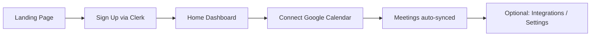
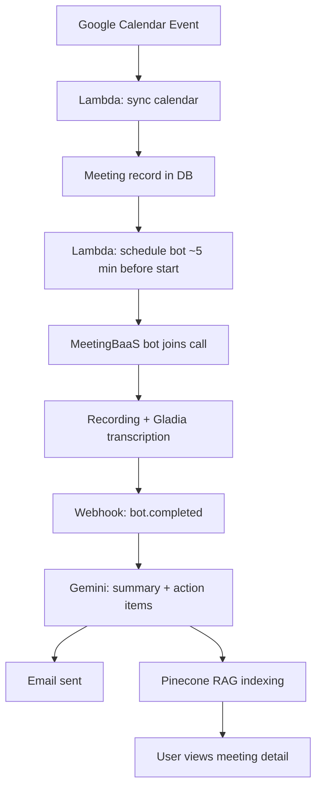
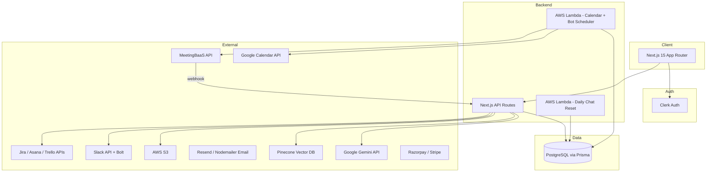
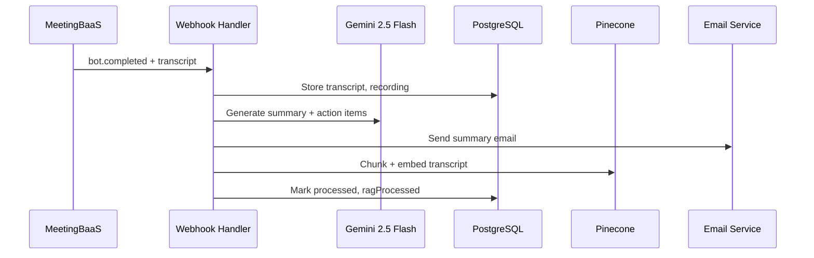

# ConvorbitAI project details
_Exported on 8/28/2026 at 21:51:29 GMT+5:30 from Cursor (3.17.8)_

---

**User**

give me thee problem statemet , features , user journeys ,  architecture  and tech stack , repo structure of ConvorbitAI in detail

---

**Cursor**

Exploring the codebase and documentation to compile a detailed overview of ConvorbitAI.


Here is a detailed breakdown of **Convorbit AI** based on the codebase (branded **Convorbit AI** in the UI; internal package name is `meet-bot`; README still references **MeetingBot**).

---

## 1. Problem Statement

**Core problem:** Meetings generate valuable context — decisions, blockers, and action items — but that context is trapped in live calls and rarely becomes execution. Teams lose time re-watching recordings, manually copying notes, and chasing follow-ups across Slack, Jira, Asana, and email.

**Convorbit AI** positions itself as an **“Intelligent Workflow Layer For Every Meeting”** — an end-to-end meeting OS that:

- Automatically joins and records video calls
- Transcribes with speaker identification
- Extracts summaries and action items with AI
- Makes meeting history searchable and conversational (RAG)
- Routes outcomes into tools teams already use

It targets the same space as **Fireflies.ai** and **Otter.ai**, as an open-source alternative with deeper workflow automation.

From the landing page:

> *“Convorbit AI captures context, extracts decisions, and routes action automatically. From live calls to follow-up execution, your team moves in one continuous system.”*

---

## 2. Features

### Core Platform (Implemented)

| Area | Capability |
|------|------------|
| **Meeting bot** | Auto-deploys AI bot to meetings via **MeetingBaaS** (Zoom, Google Meet, Microsoft Teams) |
| **Transcription** | Speaker-view recording + Gladia transcription via MeetingBaaS |
| **AI summaries** | Gemini 2.5 Flash generates summary + action items from transcript |
| **Calendar sync** | Google Calendar OAuth; syncs upcoming events (7-day window) |
| **Bot control** | Per-meeting toggle for bot attendance; custom bot name + avatar (S3 upload) |
| **Meeting dashboard** | Upcoming meetings + past meetings with navigation |
| **Meeting detail** | Transcript, summary, action items, audio playback, resizable AI chat sidebar |
| **RAG chat** | Chat with a single meeting or across all meetings (Pinecone + Gemini embeddings) |
| **Email reports** | Automated meeting summary emails after processing |
| **Integrations** | Google Calendar, Slack, Trello, Jira, Asana |
| **Action item sync** | One-click push to Trello cards, Jira issues, Asana tasks |
| **Slack bot** | `@mention` handler to query meetings from Slack (Bolt framework) |
| **Slack posting** | Post meeting summaries to configured Slack channel |
| **Auth** | Clerk authentication + Svix webhook validation |
| **Billing / limits** | Tiered plans with meeting/month and chat/day limits |
| **UI** | Next.js 15, dark theme, Shadcn UI, glass-morphism design |

### Platform Capabilities (Marketing / MagicBento cards)

1. **AI Meeting Summaries** — automatic summaries and action items
2. **Smart Calendar Integration** — Google Calendar + auto bot join
3. **Automated Email Reports** — email summaries with action items
4. **Chat with Meetings** — RAG-powered Q&A
5. **One-Click Integrations** — Slack, Asana, Jira, Trello
6. **Slack Bot Integration** — ask questions in Slack

### Expansion Features (Landing + README roadmap)

- **Exports** — download audio MP3, transcripts, summaries, action items
- **Full customization** — bot name, image, participation toggles
- **Meeting analytics** — patterns, participation, productivity (partially surfaced on home dashboard)
- **Planned integrations** — Notion, Linear, Salesforce, HubSpot
- **Past meeting search** — full-text search, date ranges, duration, participant filters
- **100+ language transcript translation** (Google Cloud Translation API)
- **Workspaces** — multi-user workspaces with invites and RBAC

### Pricing Tiers (from `app/pricing/page.tsx` + `lib/usage.ts`)

| Plan | Meetings/month | Chat messages/day | Status |
|------|----------------|-------------------|--------|
| **Starter (Free)** | 50 | 50 | Active |
| **Pro** (₹199) | 100 | 100 | Coming Soon |
| **Premium** (₹399) | Unlimited | Unlimited | Coming Soon |

Note: Code also has `free` (30 meetings) and Stripe webhook routes; **Razorpay** is used on the pricing UI; Stripe infrastructure exists in parallel.

---

## 3. User Journeys

### Journey A — New User Onboarding



1. Visit `/` → hero, features, integrations, how-it-works
2. **Sign up** at `/sign-up` (Clerk)
3. Redirected to `/home` (middleware redirects authenticated users from `/` to `/home`)
4. Connect **Google Calendar** from Integrations or Meetings
5. Customize bot in **Settings** (name, avatar)
6. View usage limits on Home sidebar

---

### Journey B — Automatic Meeting Capture (Primary Flow)



1. Calendar event with Meet/Zoom/Teams link is synced into `Meeting` table
2. **AWS Lambda** (`lambda-function`) runs periodically:
   - Syncs all connected Google Calendars (7-day lookahead)
   - Schedules bots for meetings starting within 5 minutes
3. Bot joins via **MeetingBaaS API** with user's custom name/image
4. On `bot.completed` webhook (`/api/webhooks/meetingbaas`):
   - Store transcript, recording URL, speakers
   - **Gemini** generates summary + action items
   - Send summary email
   - Chunk transcript → embed → **Pinecone** for RAG
5. User opens `/meeting/[meetingId]` to review transcript, summary, action items, audio

---

### Journey C — Meetings Hub Management

1. Go to `/meeting`
2. **Upcoming tab** — see calendar events, toggle bot on/off per meeting
3. **Past tab** — browse processed meetings, click to open detail
4. On meeting detail:
   - Read transcript with speaker labels
   - Play recording (React H5 Audio Player)
   - Edit/add/delete action items
   - Chat with that meeting in sidebar (RAG)
   - Push action items to Trello/Jira/Asana
   - Post summary to Slack

---

### Journey D — Cross-Meeting AI Chat

1. Go to `/chat`
2. Ask questions across **all indexed meetings** (e.g. “What were last week’s blockers?”)
3. RAG retrieves top 8 vector matches filtered by `userId`
4. Gemini answers with meeting context
5. Usage tracked against daily chat limit

---

### Journey E — Integrations Setup

1. `/integrations` → connect platforms:
   - **Google Calendar** — OAuth
   - **Slack** — OAuth + preferred channel setup
   - **Trello** — auth + board selection
   - **Jira** — OAuth + workspace/project selection
   - **Asana** — OAuth + project selection
2. From a meeting, push action items to connected PM tool via `/api/integrations/action-items`

---

### Journey F — Slack Bot Usage

1. Install Slack app (`/api/slack/install`, OAuth)
2. In Slack, `@mention` the bot with a question
3. Bot matches Slack email → Convorbit user
4. Runs cross-meeting RAG query
5. Replies in thread with meeting insights

---

### Journey G — Subscription / Limits

1. `/pricing` → view tiers
2. Starter is free; Pro/Premium marked “Coming Soon” (Razorpay checkout scaffolded)
3. If monthly meeting or daily chat limits hit → bot scheduling or chat blocked (`lib/usage.ts`)

---

## 4. Architecture & Tech Stack

### High-Level Architecture



### Data Flow — Post-Meeting Processing



### Tech Stack (Detailed)

| Layer | Technology |
|-------|------------|
| **Frontend** | Next.js 15 (App Router, Turbopack), React 19, TypeScript |
| **Styling** | Tailwind CSS 4, Shadcn UI, Radix UI, GSAP animations |
| **Auth** | Clerk (`@clerk/nextjs`) + Svix webhook verification |
| **Database** | PostgreSQL + Prisma ORM 6 |
| **AI / LLM** | Google Gemini 2.5 Flash via LangChain (`@langchain/google-genai`) |
| **Embeddings** | Google Generative AI embeddings (`gemini-embedding-001`, etc.) |
| **Vector DB** | Pinecone (`@pinecone-database/pinecone`) |
| **Meeting infra** | MeetingBaaS API (bot join, Gladia transcription) |
| **Calendar** | Google Calendar API + OAuth2 |
| **Serverless** | AWS Lambda (calendar sync, bot scheduling, daily chat reset) |
| **Storage** | AWS S3 (recordings, bot avatars via `@aws-sdk/client-s3`) |
| **Email** | Resend + React Email templates + Nodemailer fallback |
| **Payments** | Razorpay (UI) + Stripe (webhook routes exist) |
| **Slack** | Slack Bolt + `@slack/web-api` |
| **PM tools** | Jira, Asana, Trello REST APIs |
| **State** | React Context (`UsageContext`), custom hooks |
| **Notifications** | Sonner toast |
| **Theming** | next-themes (dark default) |

### Key Architectural Decisions

1. **MeetingBaaS as bot layer** — Convorbit does not run its own Zoom/Meet bot; it delegates to MeetingBaaS.
2. **Lambda for scheduling** — Calendar sync + bot dispatch runs outside the Next.js request cycle (scheduled, likely EventBridge).
3. **RAG pipeline** — Transcripts chunked (`lib/text-chunker.ts`) → embedded → stored in Pinecone with `userId` + `meetingId` metadata; DB also stores `TranscriptChunk` rows.
4. **Webhook-driven processing** — Post-meeting AI work triggered by MeetingBaaS `bot.completed` webhook, not polling.
5. **Usage gating** — Plan limits enforced before bot dispatch and chat API calls.

---

## 5. Repository Structure

```
Convorbit/
├── app/                          # Next.js App Router
│   ├── (auth)/                   # Clerk sign-in / sign-up
│   ├── api/                      # Backend API routes
│   │   ├── auth/google/          # Calendar OAuth connect/callback/disconnect
│   │   ├── integrations/         # Jira, Asana, Trello, Slack OAuth + action-items
│   │   ├── meetings/             # CRUD, past/upcoming, bot-toggle, action-items
│   │   ├── rag/                  # chat-meeting, chat-all, process
│   │   ├── slack/                # install, oauth, events, post-meeting
│   │   ├── stripe/               # checkout, verify-payment
│   │   ├── upload/               # bot-avatar → S3
│   │   ├── user/                 # usage, bot-settings, increment counters
│   │   └── webhooks/             # meetingbaas, clerk, stripe
│   ├── chat/                     # Global cross-meeting AI chat UI
│   ├── home/                     # Authenticated dashboard
│   ├── integrations/             # Integration management UI
│   ├── meeting/                  # Meetings hub + [meetingId] detail
│   ├── pricing/                  # Subscription tiers (Razorpay)
│   ├── settings/                 # Bot personalization
│   ├── components/               # App-level components (sidebar, landing, email)
│   ├── contexts/                 # UsageContext
│   ├── hooks/                    # Shared chat hooks
│   ├── layout.tsx                # Root layout (Clerk, Theme, Usage)
│   ├── page.tsx                  # Public landing page
│   └── globals.css
│
├── components/                   # Shared UI components
│   ├── ui/                       # Shadcn primitives (button, sidebar, etc.)
│   ├── reactbits/                # MagicBento, staggered-menu, pill-nav
│   └── magicui/                  # Animated UI effects
│
├── lib/                          # Core business logic
│   ├── ai-provider.ts            # Gemini chat + embeddings
│   ├── meeting-ai-processor.ts   # Summary + action item extraction
│   ├── rag.ts                    # RAG: chunk, embed, chat
│   ├── pinecone.ts               # Vector upsert/search
│   ├── text-chunker.ts           # Transcript chunking
│   ├── transcript-utils.ts     # Normalize transcript segments
│   ├── usage.ts                  # Plan limits + gating
│   ├── db.ts                     # Prisma client
│   ├── email-service.tsx         # Email templates
│   ├── email-service-free.tsx    # Free-tier email sender
│   ├── utils.ts
│   └── integrations/           # Jira, Asana, Trello API clients
│
├── prisma/
│   └── schema.prisma             # User, Meeting, UserIntegration, TranscriptChunk, SlackInstallation
│
├── lambda-function/              # AWS Lambda: calendar sync + bot scheduling
│   ├── index.ts
│   ├── prisma/
│   └── package.json
│
├── lambda-chat/                  # AWS Lambda: daily chat message reset
│   ├── lambda-chat-reset.ts
│   └── prisma/
│
├── scripts/
│   ├── seed-meetings.ts          # Dev seed script
│   └── data/                     # Sample transcripts, summaries, action items
│
├── public/                       # Static assets (integration logos referenced in code)
├── middleware.ts                 # Clerk middleware + / → /home redirect
├── package.json                  # Root deps (name: "meet-bot")
├── README.md                     # Feature list + setup guide
└── docs/
    └── ConvorbitAI.md            # (Untracked — not readable in workspace)
```

### Database Models (Prisma)

| Model | Purpose |
|-------|---------|
| **User** | Clerk ID, calendar/Slack tokens, plan, usage counters, bot customization |
| **Meeting** | Calendar event, bot state, transcript, summary, action items, RAG flags |
| **UserIntegration** | OAuth tokens + board/project/channel config per platform |
| **TranscriptChunk** | Chunked transcript text + Pinecone vector ID |
| **SlackInstallation** | Workspace-level Slack bot token storage |

### API Surface (40 route handlers)

Grouped by domain: **auth**, **meetings**, **rag**, **integrations** (5 platforms), **slack**, **stripe**, **user**, **upload**, **webhooks**.

---

## Summary

**Convorbit AI** is a meeting intelligence SaaS that closes the loop from **live call → transcript → AI insights → execution in external tools**. Its architecture is a **Next.js monolith** for UI + APIs, **AWS Lambda** for scheduled calendar/bot orchestration, **MeetingBaaS** for bot infrastructure, **Gemini + Pinecone** for AI/RAG, and **Clerk + PostgreSQL** for auth and persistence.

If you want, I can go deeper on any slice — e.g. the RAG pipeline, Lambda scheduling logic, or integration OAuth flows — in a follow-up.

